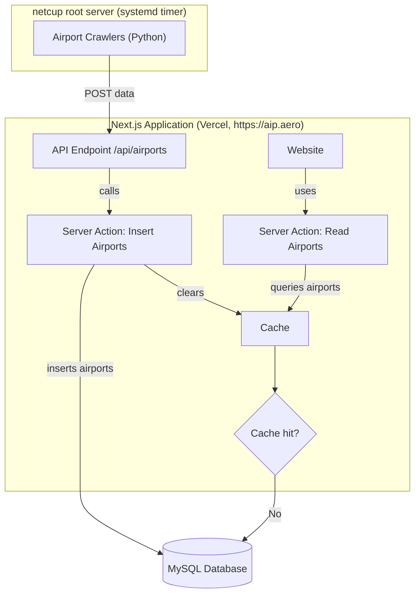

# AIP:Aero Next.js Frontend

This repo contains the code for [https://aip.aero](https://aip.aero). It is a [T3 Stack](https://create.t3.gg/) project bootstrapped with `create-t3-app`.

## Hosting

The project is split across two hosts:

- **Website (`src/`) → [Vercel](https://vercel.com).** The new `aip.aero` is served from Vercel via the GitHub integration.
- **Crawlers (`crawlers/`) → [netcup](https://www.netcup.eu/) root server.** The Python scrapers stay on the existing netcup VM under systemd (`aip-crawler.service` + `aip-crawler.timer`). Serverless is the wrong runtime for scheduled, long-running scraping, so the crawlers are **not** deployed to Vercel. They reach the website over HTTP and post results to `https://aip.aero/api/airports`.

The Docker setup (`Dockerfile` / `docker-compose.yml`) is the legacy way the website used to run on the same netcup host. It's kept for local container testing only and is no longer the production path.

## Design Architecture



## Used Libraries

- [Next.js](https://nextjs.org) (App Router, React 19)
- [Drizzle](https://orm.drizzle.team) ORM with MySQL
- [Tailwind CSS](https://tailwindcss.com)
- [next-intl](https://next-intl-docs.vercel.app/) for i18n
- [next-axiom](https://github.com/axiomhq/next-axiom) for logging

## Local Development

```bash
pnpm install
cp .env.example .env   # fill in DATABASE_*, CRON_SECRET, ADSENSE_ID, AXIOM tokens
./start-database.sh    # optional: spins up a local MySQL via Docker
pnpm dev               # starts Next.js with Turbopack
```

Useful scripts: `pnpm check` (lint + typecheck), `pnpm db:push`, `pnpm db:studio`, `pnpm format:write`.

## Deployment

### Vercel (current)

Deployments happen automatically via the Vercel GitHub integration on pushes to the production branch. Required environment variables are managed through the Vercel project settings and must mirror `.env.example` (`DATABASE_HOST`, `DATABASE_PORT`, `DATABASE_USER`, `DATABASE_PASSWORD`, `DATABASE_NAME`, `CRON_SECRET`, `ADSENSE_ID`, `NEXT_PUBLIC_AXIOM_DATASET`, `NEXT_PUBLIC_AXIOM_TOKEN`).

The MySQL database is reachable from Vercel's serverless functions over the public network — make sure the database host whitelists Vercel's egress and that connections use TLS.

See the official [Vercel deployment guide for T3](https://create.t3.gg/en/deployment/vercel) for details.

### Docker (legacy)

```bash
docker compose up --build -d
```

The container exposes port `3000` internally (mapped to `127.0.0.1:8080` by `docker-compose.yml`) and used to sit behind a reverse proxy on the netcup host. This path is no longer used in production — it remains only for local container testing.

### Crawlers (netcup)

The Python crawlers under `crawlers/` run on the netcup root server, scheduled by `aip-crawler.timer`. They use `httpx` + `BeautifulSoup` for static AIP sites (AT, NL, UK, FR are on this path; DE is the last Selenium holdout). See `crawlers/README.md` for the per-country status, the `Airport` schema, and how to add a new country.

## Learn More

To learn more about the [T3 Stack](https://create.t3.gg/), take a look at the following resources:

- [Documentation](https://create.t3.gg/)
- [Learn the T3 Stack](https://create.t3.gg/en/faq#what-learning-resources-are-currently-available)

You can check out the [create-t3-app GitHub repository](https://github.com/t3-oss/create-t3-app) — feedback and contributions are welcome!
