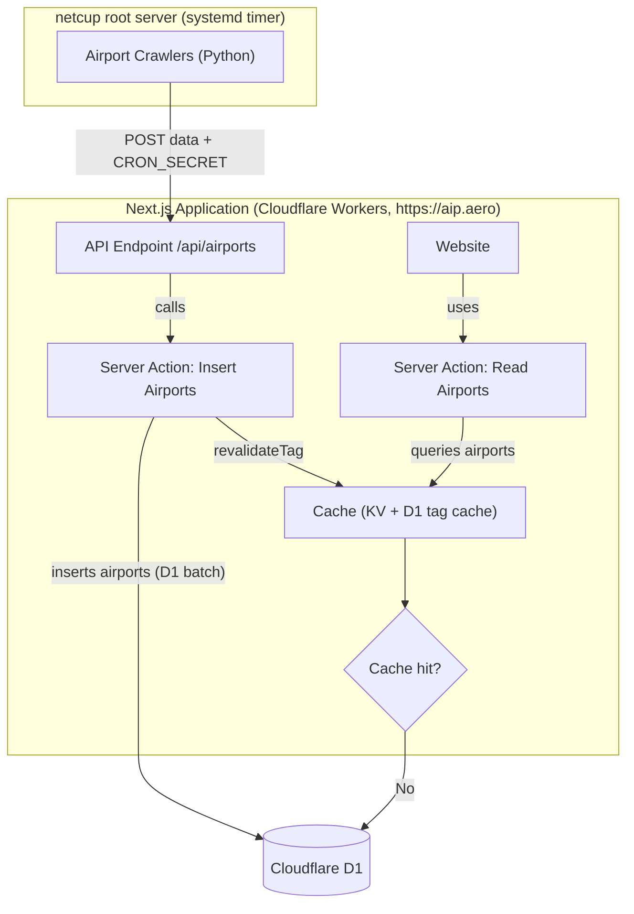

# AIP:Aero Next.js Frontend

This repo contains the code for [https://aip.aero](https://aip.aero). It is a [T3 Stack](https://create.t3.gg/) project bootstrapped with `create-t3-app`.

## Hosting

The project is split across two hosts by design — they are independent deploy targets that communicate only over HTTP:

- **Website (`src/`) → [Cloudflare Workers](https://workers.cloudflare.com/)** via the [OpenNext Cloudflare adapter](https://opennext.js.org/cloudflare) (`@opennextjs/cloudflare`). Config lives in `wrangler.jsonc` + `open-next.config.ts`. The Worker serves both `aip.aero` (canonical) and `www.aip.aero` (301-redirected to the apex in `src/middleware.ts`); `workers.dev` is disabled.
- **Database → [Cloudflare D1](https://developers.cloudflare.com/d1/)** (SQLite), reached through the `DB` binding — there is no connection string. Two more Cloudflare resources back OpenNext caching: a KV namespace (`NEXT_INC_CACHE_KV`, incremental/data cache) and a D1 database (`NEXT_TAG_CACHE_D1`, backs `revalidateTag`).
- **Crawlers (`crawlers/`) → [netcup](https://www.netcup.eu/) root server.** The Python scrapers stay on the existing netcup VM under systemd (`aip-crawler.service` + `aip-crawler.timer`). Serverless is the wrong runtime for scheduled, long-running scraping, so the crawlers are **not** deployed to Workers. They reach the website over HTTP and post results to `https://aip.aero/api/airports` (authenticated with `CRON_SECRET`).

Treat all Next.js code as serverless on the Workers runtime: no persistent filesystem, no long-running handlers, no Chromium/Selenium, no raw Node TCP.

The website previously ran on [Vercel](https://vercel.com) and, before that, on netcup via Docker (`Dockerfile` / `docker-compose.yml`). Both are retired for serving the website; the Docker files are kept for local container testing only.

## Design Architecture



## Used Libraries

- [Next.js](https://nextjs.org) (App Router, React 19) on [Cloudflare Workers](https://workers.cloudflare.com/) via [OpenNext](https://opennext.js.org/cloudflare)
- [Drizzle](https://orm.drizzle.team) ORM with [Cloudflare D1](https://developers.cloudflare.com/d1/) (SQLite)
- [Tailwind CSS](https://tailwindcss.com)
- [next-intl](https://next-intl-docs.vercel.app/) for i18n

## Local Development

```bash
pnpm install
cp .env.example .env             # fill in CRON_SECRET, ADSENSE_ID
cp .dev.vars.example .dev.vars   # secrets/vars for `pnpm preview` (Workers)
pnpm dev                         # Next.js dev server with Turbopack
```

Run the app on the Workers runtime locally (miniflare + local D1/KV):

```bash
wrangler d1 migrations apply DB --local   # create the schema in the local D1
pnpm preview                              # build with OpenNext + serve the Worker
```

Useful scripts: `pnpm check` (lint + typecheck), `pnpm db:generate`, `pnpm db:studio`, `pnpm format:write`, `pnpm cf-build`.

## Deployment

### Cloudflare Workers (current)

The website runs on Cloudflare Workers via the OpenNext adapter (`wrangler.jsonc` + `open-next.config.ts`).

**One-time resource setup.** Create the resources and paste the returned IDs into `wrangler.jsonc` (they ship as `REPLACE_WITH_*` placeholders in the `DB` / `NEXT_TAG_CACHE_D1` / `NEXT_INC_CACHE_KV` bindings — put each real ID into the *matching* binding, not a new one the wizard offers to append):

```bash
wrangler d1 create aip-aero                      # app DB     -> binding DB
wrangler d1 create aip-aero-tag-cache            # tag cache  -> NEXT_TAG_CACHE_D1
wrangler kv namespace create NEXT_INC_CACHE_KV   # incr cache -> NEXT_INC_CACHE_KV
wrangler secret put CRON_SECRET                  # Bearer token for /api/airports
wrangler secret put ADSENSE_ID
wrangler d1 migrations apply DB --remote          # apply the schema to production D1
```

**Deploy.** The `deploy` script builds with OpenNext and deploys the Worker. Use `pnpm run deploy` (not `pnpm deploy` — pnpm intercepts the bare `deploy` command). Secrets live on the Worker, not in your shell, so skip env validation for the build step:

```bash
SKIP_ENV_VALIDATION=true pnpm run deploy
```

The crawlers repopulate the data by POSTing to `/api/airports`; a fresh D1 starts empty until the first crawler run (or a manual POST with `CRON_SECRET`).

**Custom domains.** `aip.aero` and `www.aip.aero` are bound as custom domains in `wrangler.jsonc` (`routes` with `custom_domain: true`); Wrangler provisions the DNS records and certificates. If the apex/www hostname already has a plain A/CNAME record in the zone, Cloudflare returns `409` (error `100117`, "Hostname already has externally managed DNS records") — delete that record in the dashboard first, then re-run the deploy. `www.aip.aero` is 301-redirected to the apex in `src/middleware.ts`.

### Docker (legacy)

```bash
docker compose up --build -d
```

The container exposes port `3000` internally (mapped to `127.0.0.1:8080` by `docker-compose.yml`) and used to sit behind a reverse proxy on the netcup host. This path is no longer used in production — it remains only for local container testing.

### Crawlers (netcup)

The Python crawlers under `crawlers/` run on the netcup root server, scheduled by `aip-crawler.timer`. They use `httpx` + `BeautifulSoup` for static AIP sites (AT, DE, FR, NL, UK are all on this path). See `crawlers/README.md` for the per-country status, the `Airport` schema, and how to add a new country.

## Learn More

To learn more about the [T3 Stack](https://create.t3.gg/), take a look at the following resources:

- [Documentation](https://create.t3.gg/)
- [Learn the T3 Stack](https://create.t3.gg/en/faq#what-learning-resources-are-currently-available)

You can check out the [create-t3-app GitHub repository](https://github.com/t3-oss/create-t3-app) — feedback and contributions are welcome!
