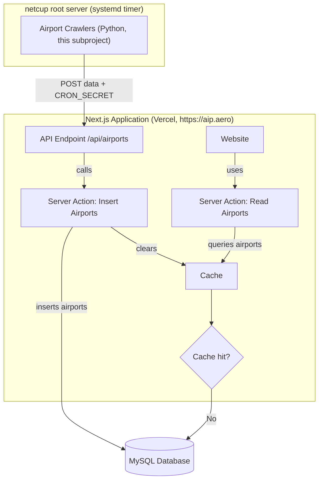

# Airport Crawlers

Python web scrapers that extract aerodrome / heliport / military airfield listings from the official AIP publications of European civil-aviation authorities and POST them to the AIP:Aero API.

## Hosting

These crawlers run on the **netcup root server** (not on Vercel) under systemd:

- `aip-crawler.service` — one-shot service that runs `uv run main.py`
- `aip-crawler.timer`   — schedules the service
- `notify-failure@.service` — failure notification hook

The website itself is hosted on Vercel; the crawlers reach it over HTTPS at `https://aip.aero/api/airports`, authenticating with the shared `CRON_SECRET`. During local development, point them at `http://localhost:3000` instead.

Serverless platforms (Vercel, Lambda, etc.) are explicitly **not** a target: scheduled, long-running, browser-driven scraping doesn't fit that runtime model.

## Stack

- Python ≥ 3.12, managed with [uv](https://github.com/astral-sh/uv)
- HTTP: `httpx` + `BeautifulSoup` for static pages — preferred and used by AT, NL, UK, FR
- Browser fallback: a single Playwright (Python) path for sites that genuinely require JS rendering — only when there's no static URL to follow
- Pydantic for the `Airport` model (`crawlers/crawlers/models.py`) and settings

> **Note on Selenium.** The original crawlers used Selenium + `webdriver-manager`. None of the active sites need a JS engine — they serve static HTML, sometimes inside legacy framesets. AT, NL, UK, and FR have been ported off Selenium; DE is the last holdout and will follow once we've verified the new HTTP path on the netcup host. New crawlers must not introduce Selenium. **Do not** use Puppeteer (Node-only) or any other browser stack.

## Base classes

| Module                    | Class                  | Use when                                                 |
| ------------------------- | ---------------------- | -------------------------------------------------------- |
| `http_base.py`            | `HttpCrawlerBase`      | The source serves static HTML over HTTP (default choice). |
| `http_eurocontrol_base.py`| `HttpEurocontrolBase`  | The source is a eurocontrol-style eAIP frameset (used by NL, UK, FR). |
| `crawler_base.py`         | `CrawlerBase`          | *Legacy, Selenium.* Only DE still inherits from it.      |
| `eurocontrol_base.py`     | `EurocontrolBase`      | *Legacy, Selenium.* Orphaned, slated for deletion.       |

`HttpCrawlerBase` provides `fetch(url, encoding=…)`, `soup(html)`, `get_frame_src(html, base_url, name)`, `follow_frame_chain(start_url, [name1, name2, …])`, `clean_text(text)`, and `save_response(url, body, prefix)` for dumping the last response to `error_logs/` on failure. `HttpEurocontrolBase` adds `extract_airports_from_html(html, base_url, id_in_menu, category)`, which parses the standard eAIP nav menu (paired title/details `<div>`s) and prefers `<a title*='charts related'>` for the airport's chart URL.

## Country Status

Active (in `crawlers/`):

- [x] Austria (https://eaip.austrocontrol.at) — `HttpCrawlerBase`
- [x] Germany (https://aip.dfs.de/) — *Selenium (legacy)*, port pending
- [x] France (https://www.sia.aviation-civile.gouv.fr/plandesite) — `HttpEurocontrolBase`
- [x] Netherlands (https://eaip.lvnl.nl/) — `HttpEurocontrolBase`
- [x] United Kingdom (https://nats-uk.ead-it.com/) — `HttpEurocontrolBase`

Open (see `tasks/` for per-country research notes):

1. [ ] Denmark (https://aim.naviair.dk/)
2. [ ] Norway (https://avinor.no/en/ais/aipnorway/)
3. [ ] Sweden (https://aro.lfv.se/content/eaip/default_offline.html)
4. [ ] Poland (https://www.ais.pansa.pl/en/publications/aip-poland/)
5. [ ] Czech Republic (https://aim.rlp.cz/eaip/html/index-cz-CZ.html)
6. [ ] Croatia (https://www.crocontrol.hr/UserDocsImages/AIS%20produkti/eAIP/start.html)
7. [ ] Greece (https://aisgr.hasp.gov.gr/)
8. [ ] Belgium + Luxembourg (https://ops.skeyes.be/html/belgocontrol_static/eaip/eAIP_Main/html/index-en-GB.html)

## What to extract

From each country's **AIP PART 3 — AD (Aerodromes)**:

- ~AD 0 AERODROMES~ (skipped)
- ~AD 1 AERODROMES-HELIPORTS — INTRODUCTION~ (skipped)
- **AD 2 AERODROMES** (extracted)
- **AD 3 HELIPORTS** (extracted)
- **AD 4 MILITARY** (extracted)

For each airport, capture:

- ICAO code (4 capital letters), if published
- Title of the airport
- URL pointing to the airport's chart page

Each airport has exactly one category:

- `vfr`
- `ifr`
- `heliport`
- `mil`
- `aeroport` (only when the source publication doesn't categorise the airfield)

## Crawler interface

Every country crawler inherits `HttpCrawlerBase` (or `HttpEurocontrolBase` for eurocontrol eAIPs) and implements `crawl()`, returning a list of:

```python
class Airport(BaseModel):
    country: str
    icao: str | None
    title: str
    url: str
    airport_type: Literal["vfr", "ifr", "heliport", "mil", "aeroport"] = Field(alias="type")
```

The model lives in `crawlers/crawlers/models.py`. Register the new crawler in `main.py`; output is written by `OutputHandler.write_output(airports, country)`.

A minimal eurocontrol-style crawler looks like:

```python
from crawlers.http_base import Airport
from crawlers.http_eurocontrol_base import HttpEurocontrolBase

class XX(HttpEurocontrolBase):
    def __init__(self): super().__init__("XX")

    def crawl(self) -> list[Airport]:
        try:
            edition_url = ...                              # find current edition
            nav_url, nav_html = self.follow_frame_chain(
                edition_url, ["eAISNavigationBase", "eAISNavigation"]
            )
            return [
                *self.extract_airports_from_html(nav_html, nav_url, "AD-2details", "vfr"),
                *self.extract_airports_from_html(nav_html, nav_url, "AD-3details", "heliport"),
            ]
        finally:
            self.close()
```

## Running

```bash
uv sync
uv run main.py
```

Logs go to stdout and to `crawlers.log`. On failures, the HTTP-based crawlers persist the last response body to `error_logs/` via `save_response()` so the failure can be reproduced offline against the same bytes the parser saw. The remaining Selenium crawler (DE) writes a screenshot + page source instead.

## Architecture


