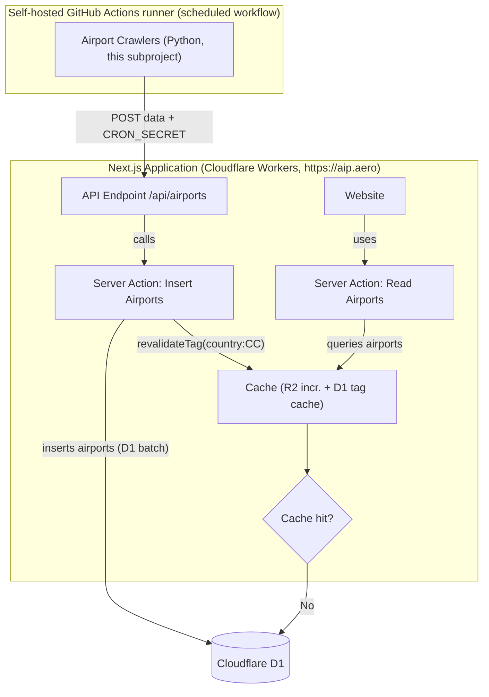

# Airport Crawlers

Python web scrapers that extract aerodrome / heliport / military airfield listings from the official AIP publications of European civil-aviation authorities and POST them to the AIP:Aero API.

## Hosting

The crawlers run as **GitHub Actions workflows on the self-hosted runner** (the runner lives on the Coolify/netcup box and also runs the crawler live-test). This replaced the old systemd timer on a bare-metal netcup host: Actions checks out the repo fresh each run (no code drift), gives run logs + a manual trigger, and needs no crawler Dockerfile or baked-in browser.

- **`.github/workflows/crawl.yml`** — *Crawl (publish)*. Runs `uv run main.py` daily (03:00 UTC) and POSTs to `https://aip.aero/api/airports` (Bearer `CRON_SECRET`). Manually triggerable, optionally for a subset of countries. Installs headless Chromium per run for the DK Playwright fallback. Persists `last_run_counts.json` via `actions/cache` so the OutputHandler's > 50 % drop guard survives the ephemeral runner.
- **`.github/workflows/facts-import.yml`** — *Airport facts import*. Runs `import_ourairports.py` weekly (Sun 03:30 UTC) → POSTs OurAirports facts to `/api/airport-facts`. Idempotent.
- **`.github/workflows/crawler-live-test.yml`** — dry-run validation (no publish) for new/changed crawlers.

Secrets used (repo → Settings → Secrets and variables → Actions): `CRON_SECRET` (required), `BRIGHTDATA_UNLOCKER_URL` (GR captcha), `BRIGHTDATA_PROXY_URL` (optional). During local development, run `main.py` directly and point `API_ENDPOINT` at `http://localhost:3000/api/airports`.

The website itself runs on Cloudflare Workers (via the OpenNext adapter). Serverless platforms (Cloudflare Workers, Vercel, Lambda, etc.) are explicitly **not** a target for running the crawlers: scheduled, browser-capable scraping doesn't fit that runtime model - hence the self-hosted runner.

## Stack

- Python ≥ 3.12, managed with [uv](https://github.com/astral-sh/uv)
- HTTP: `httpx` + `BeautifulSoup` for static pages - the path nearly every crawler uses; the ~50 active country crawlers are on it
- Browser fallback: a single Playwright (Python) path for sites that genuinely require JS rendering (DE, DK, RS) — only when there's no static URL to follow
- Pydantic for the `Airport` model (`crawlers/crawlers/models.py`) and settings

> **Note on Selenium.** The original crawlers used Selenium + `webdriver-manager`, but none of the active sites need a JS engine - they serve static HTML, sometimes inside legacy framesets. **Every active crawler runs on httpx** (DE, DK and RS render via Playwright). Selenium has been fully removed: the legacy `crawler_base.py` / `eurocontrol_base.py` bases, the experimental crawlers (belgium, car_sam_nam, pac_n, pac_p, run) and the `cache_warmer.py` script are gone, along with the `selenium` / `webdriver-manager` dependencies. New crawlers must not reintroduce Selenium. **Do not** use Puppeteer (Node-only) or any other browser stack.

## Base classes

| Module                    | Class                  | Use when                                                 |
| ------------------------- | ---------------------- | -------------------------------------------------------- |
| `http_base.py`            | `HttpCrawlerBase`      | The source serves static HTML over HTTP (default choice). |
| `http_eurocontrol_base.py`| `HttpEurocontrolBase`  | The source is a eurocontrol-style eAIP frameset (used by most eAIP crawlers: NL, UK, FR, BE, CZ, GR, NO, PL, SE). |
| `playwright_base.py`      | `PlaywrightCrawlerBase`| The source is a client-rendered JS app with no static HTML (DK/Naviair). Renders via headless Chromium (lazy import). |

`HttpCrawlerBase` provides `fetch(url, encoding=…)`, `soup(html)`, `get_frame_src(html, base_url, name)`, `follow_frame_chain(start_url, [name1, name2, …])`, `clean_text(text)`, and `save_response(url, body, prefix)` for dumping the last response to `error_logs/` on failure. `HttpEurocontrolBase` adds `extract_airports_from_html(html, base_url, id_in_menu, category)`, which parses the standard eAIP nav menu (paired title/details `<div>`s) and prefers `<a title*='charts related'>` for the airport's chart URL.

## Country Status

The live roster is **~50 country crawlers**. To avoid a second list that drifts,
this README does not enumerate them - the source of truth is:

- **`COUNTRY_CRAWLERS` in `main.py`** (which classes are registered), and
- the **Supported Countries** table in the repo-root **`CLAUDE.md`** (per-country
  AIP source, base class, and gated/open status).

Three shapes of crawler:

- **Real chart scrapers** (most countries): a `HttpEurocontrolBase` eAIP crawler
  (NL, UK, FR, BE, CZ, NO, PL, SE, EE, FI, LV, IS, PT, HU, SI, IE, SK, BA, AL,
  GE, AM, KZ, XK) or a bespoke `HttpCrawlerBase` for a non-eurocontrol source
  (AT, DE, ES, GR, RO, MK, CY, LT). They capture each aerodrome's chart page/PDF.
- **Playwright** (`PlaywrightCrawlerBase`): DE (DFS AD-2 page images, OCR path),
  DK (Naviair - now driven off the Umbraco JSON API; the render is a diagnostic
  fallback) and RS (JS-rendered SMATSA public VFR AD page).
- **Info-page / gated**: countries whose AIP is behind a login/paywall/WAF
  (`gatedCountries` in `src/lib/utils.ts`: CH, MT, MD, IT, HR, BG, TR, AZ, UA,
  UZ, BY, RU, TJ, TM, KG, plus AU, NZ). Each reads the aerodrome list from
  **OurAirports (CC0)** and links the official portal - **no chart crawl by
  design** (respect the access control).

**Known-blocked** (their live-test failure is tolerated via `ALLOWED_FAILURES` in
`.github/workflows/crawler-live-test.yml`): **DK** and **GR** - both are otherwise
handled in production (DK via the JSON API; GR reads each AIRAC edition's static
tree through the plain Bright Data proxy, since the `.gov` landing is blocked).
See `docs/open-tasks.md` for the running status.

The OurAirports facts importer's `COUNTRIES` set (`import_ourairports.py`) must
cover every live country's ISO code; `scripts/check-live-countries-coverage.mjs`
gates that in CI (a missing country ships with an empty "airports near me" map).

## What to extract

From each country's **AIP PART 3 — AD (Aerodromes)**:

- ~AD 0 AERODROMES~ (skipped)
- ~AD 1 AERODROMES-HELIPORTS — INTRODUCTION~ (skipped)
- **AD 2 AERODROMES** (extracted)
- **AD 3 HELIPORTS** (extracted)
- **AD 4 MILITARY** (extracted)

For each airport, capture:

- ICAO code (4 capital letters), if published
- Title of the airport
- URL pointing to the airport's chart page

Each airport has exactly one category:

- `vfr`
- `ifr`
- `heliport`
- `mil`
- `aeroport` (only when the source publication doesn't categorise the airfield)

## Crawler interface

Every country crawler inherits `HttpCrawlerBase` (or `HttpEurocontrolBase` for eurocontrol eAIPs) and implements `crawl()`, returning a list of:

```python
class Airport(BaseModel):
    country: str
    icao: str | None
    title: str
    url: str
    pdf_url: str | None = None  # exact chart PDF, when the source exposes a stable one
    airport_type: Literal["vfr", "ifr", "heliport", "mil", "aeroport"] = Field(alias="type")
```

The model lives in `crawlers/crawlers/models.py`. `pdf_url` is optional
(chart-PDF plan Stage 2, `docs/chart-pdf-plan.md`): set it when the source
exposes a stable direct-PDF link for the airport's charts; leave it `None`
otherwise - the website then falls back to `url`. Register the new crawler in `main.py`; output is written by `OutputHandler.write_output(airports, country)`.

A minimal eurocontrol-style crawler looks like:

```python
from crawlers.http_base import Airport
from crawlers.http_eurocontrol_base import HttpEurocontrolBase

class XX(HttpEurocontrolBase):
    def __init__(self): super().__init__("XX")

    def crawl(self) -> list[Airport]:
        try:
            edition_url = ...                              # find current edition
            nav_url, nav_html = self.follow_frame_chain(
                edition_url, ["eAISNavigationBase", "eAISNavigation"]
            )
            return [
                *self.extract_airports_from_html(nav_html, nav_url, "AD-2details", "vfr"),
                *self.extract_airports_from_html(nav_html, nav_url, "AD-3details", "heliport"),
            ]
        finally:
            self.close()
```

## Running & re-triggering a crawl

Local run:

```bash
uv sync
uv run main.py            # crawls all active countries (the ~50 in main.py's COUNTRY_CRAWLERS)
uv run main.py NL UK      # crawls only the given countries (codes are case-insensitive)
```

In production the crawl runs via the **Crawl (publish)** Actions workflow (daily + manual). To re-trigger on demand (e.g. after a source publishes a new AIRAC edition): GitHub → **Actions → Crawl (publish) → Run workflow**, optionally passing a space-separated `countries` input for a subset, and `force_publish` to override the drop guard.

**Re-triggering a single country (e.g. NL and UK):** pass the country codes — via the workflow's `countries` input, or locally `uv run main.py NL UK` (codes are case-insensitive; an unknown code aborts the run rather than silently crawling a subset). Each country POST is independent: it replaces only that country's rows via a D1 batch and busts only its `country:<CC>` cache tag, so re-crawling a subset never touches the others. `OutputHandler` refuses to publish a country whose airport count dropped > 50 % from the last successful run; override with `CRAWLER_FORCE_PUBLISH=1` (the workflow's `force_publish` input sets this).

Logs go to stdout and to `crawlers.log`. On failures, the crawlers persist the last response body to `error_logs/` via `save_response()` so the failure can be reproduced offline against the same bytes the parser saw.

## Adding a new country

1. Copy `tasks/_TEMPLATE.md` to `tasks/crawler_<country>.md` and fill in the source URL, the AD-section → type mapping, and the title/ICAO/URL extraction notes.
2. Implement `crawlers/crawlers/<cc>.py` inheriting `HttpCrawlerBase` (or `HttpEurocontrolBase` for eurocontrol eAIPs) — see the “Crawler interface” section below and the existing AT/DE/FR/NL/UK crawlers.
3. Register the class in `main.py`'s active list.
4. Add `crawlers/tests/test_<cc>.py` and include the country in the CI import smoke test.
5. Prefer a **static permalink** for each airport's chart URL when the source offers one, so links survive AIRAC amendments (see `de.py`).

## Aerodrome facts importer (OurAirports)

Besides the country crawlers, `import_ourairports.py` populates the website's
embedded aerodrome-facts card (runways / frequencies / coordinates / elevation).
It downloads the public-domain OurAirports CSVs, filters them to the 12 covered
countries, and POSTs normalized per-ICAO rows to `POST /api/airport-facts` (same
`CRON_SECRET` Bearer auth as the crawlers). The website merges these with OpenAIP
at request time when `OPENAIP_API_KEY` is set. This is **not** a country crawler
and is not run by `main.py`.

In production this runs weekly via the **Airport facts import** Actions workflow (`.github/workflows/facts-import.yml`, Sun 03:30 UTC) and is manually triggerable (Actions → *Airport facts import* → *Run workflow*). Run it once manually to populate the facts the first time. Locally / explicitly:

```bash
API_BASE=https://aip.aero API_KEY=<CRON_SECRET> uv run python import_ourairports.py
# reuses the crawlers' .env for API_ENDPOINT/API_KEY if present
```

## Architecture


