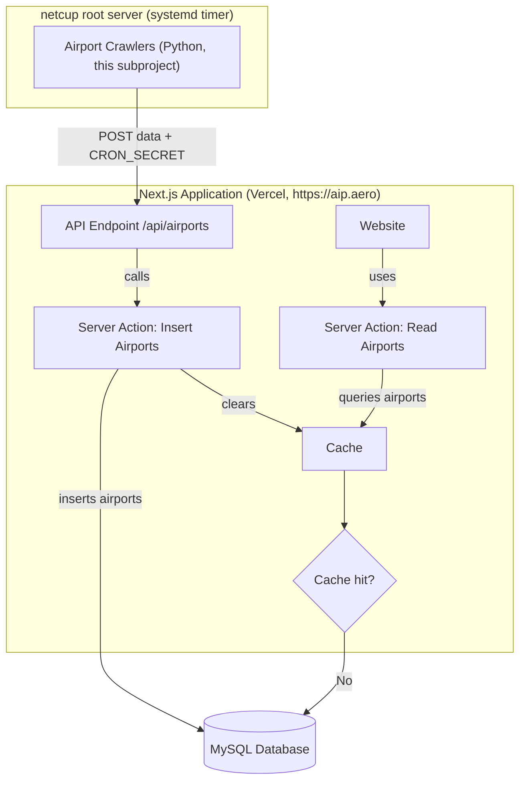

# Airport Crawlers

Python web scrapers that extract aerodrome / heliport / military airfield listings from the official AIP publications of European civil-aviation authorities and POST them to the AIP:Aero API.

## Hosting

These crawlers run on the **netcup root server** (not on Vercel) under systemd:

- `aip-crawler.service` — one-shot service that runs `uv run main.py`
- `aip-crawler.timer`   — schedules the service
- `notify-failure@.service` — failure notification hook

The website itself is hosted on Vercel; the crawlers reach it over HTTPS at `https://aip.aero/api/airports`, authenticating with the shared `CRON_SECRET`. During local development, point them at `http://localhost:3000` instead.

Serverless platforms (Vercel, Lambda, etc.) are explicitly **not** a target: scheduled, long-running, browser-driven scraping doesn't fit that runtime model.

## Stack

- Python ≥ 3.12, managed with [uv](https://github.com/astral-sh/uv)
- HTTP: `httpx` (async) + `BeautifulSoup` / `selectolax` for static pages — preferred
- Browser fallback: a single Playwright (Python) path for sites that genuinely require JS rendering — only when there's no static URL to follow
- Pydantic for the `Airport` model and settings

> **Note on Selenium.** The original crawlers used Selenium + `webdriver-manager`. None of the active sites (AT, DE, FR, NL, UK) actually need a JS engine — they serve static HTML, sometimes inside legacy framesets. The migration to plain HTTP is in progress; new crawlers should not introduce Selenium. **Do not** use Puppeteer (Node-only) or any other browser stack.

## Country Status

Active (in `crawlers/`):

- [x] Austria (https://eaip.austrocontrol.at)
- [x] Germany (https://aip.dfs.de/)
- [x] France (https://www.sia.aviation-civile.gouv.fr/plandesite)
- [x] Netherlands (https://eaip.lvnl.nl/)
- [x] United Kingdom (https://nats-uk.ead-it.com/)

Open (see `tasks/` for per-country research notes):

1. [ ] Denmark (https://aim.naviair.dk/)
2. [ ] Norway (https://avinor.no/en/ais/aipnorway/)
3. [ ] Sweden (https://aro.lfv.se/content/eaip/default_offline.html)
4. [ ] Poland (https://www.ais.pansa.pl/en/publications/aip-poland/)
5. [ ] Czech Republic (https://aim.rlp.cz/eaip/html/index-cz-CZ.html)
6. [ ] Croatia (https://www.crocontrol.hr/UserDocsImages/AIS%20produkti/eAIP/start.html)
7. [ ] Greece (https://aisgr.hasp.gov.gr/)
8. [ ] Belgium + Luxembourg (https://ops.skeyes.be/html/belgocontrol_static/eaip/eAIP_Main/html/index-en-GB.html)

## What to extract

From each country's **AIP PART 3 — AD (Aerodromes)**:

- ~AD 0 AERODROMES~ (skipped)
- ~AD 1 AERODROMES-HELIPORTS — INTRODUCTION~ (skipped)
- **AD 2 AERODROMES** (extracted)
- **AD 3 HELIPORTS** (extracted)
- **AD 4 MILITARY** (extracted)

For each airport, capture:

- ICAO code (4 capital letters), if published
- Title of the airport
- URL pointing to the airport's chart page

Each airport has exactly one category:

- `vfr`
- `ifr`
- `heliport`
- `mil`
- `aeroport` (only when the source publication doesn't categorise the airfield)

## Crawler interface

Every country crawler inherits `CrawlerBase` (`crawlers/crawler_base.py`) and implements `crawl()`, returning a list of:

```python
class Airport(BaseModel):
    country: str
    icao: str | None
    title: str
    url: str
    airport_type: Literal["vfr", "ifr", "heliport", "mil", "aeroport"] = Field(alias="type")
```

Register the new crawler in `main.py`. Output is written by `OutputHandler.write_output(airports, country)`.

## Running

```bash
uv sync
uv run main.py
```

Logs go to stdout and to `crawlers.log`. On failures, `crawler_base.py` writes a screenshot + page source to `error_logs/` for debugging — once a crawler is migrated off Selenium, that fallback drops to just the HTTP response.

## Architecture


