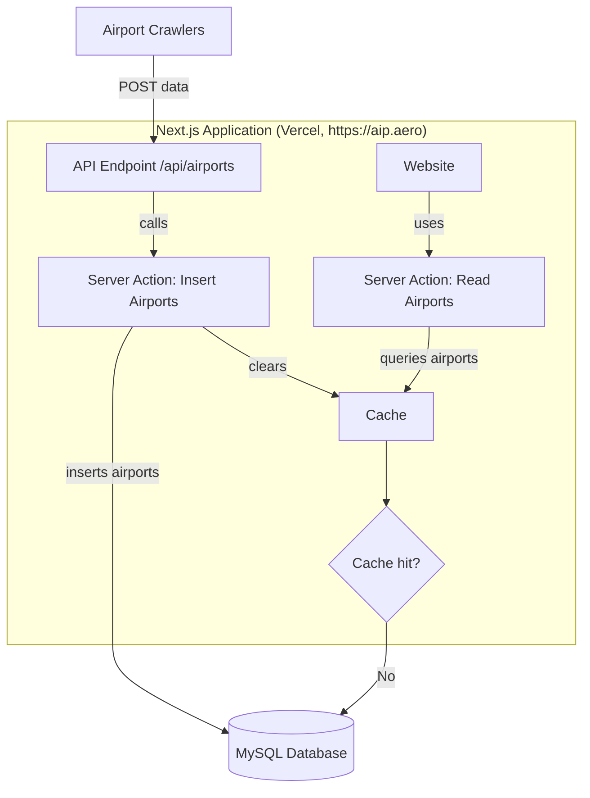

# ✈️ Development of Python Webscrapers
- Your task is to develop Python webscrapers using **Selenium Headless**
- You shall write webscrapers (extracting the airports) **for every country**:

1. [ ] Denmark (https://aim.naviair.dk/)
3. [ ] Norway (https://avinor.no/en/ais/aipnorway/)
4. [ ] Sweden (https://aro.lfv.se/content/eaip/default_offline.html)
5. [ ] Poland (https://www.ais.pansa.pl/en/publications/aip-poland/)
6. [ ] Czech Republic (https://aim.rlp.cz/eaip/html/index-cz-CZ.html)
7. [ ] Croacia (https://www.crocontrol.hr/UserDocsImages/AIS%20produkti/eAIP/start.html)
8. [ ] Greece (https://aisgr.hasp.gov.gr/)
9. [ ] France (https://www.sia.aviation-civile.gouv.fr/plandesite)
10. [ ] Belgium+Luxembourg (https://ops.skeyes.be/html/belgocontrol_static/eaip/eAIP_Main/html/index-en-GB.html)

## What should you extract?

We need of every country the **AIP PART 3 / (AD)**. This is often structured into 
- ~AD 0 AERODROMES~ (not needed by us)
- ~AD 1 AERODROMES-HELIPORTS - INTRODUCTION~ (not needed by us)
- **AD 2 AERODROMES** (needed)
- **AD 3 HELIPORTS** (needed)
- **AD 4 MILITARY** (needed as well)

For each airport we need the following information:
- ICAO Code if available (4 capital letters)
- Title of the airport
- URL of 

- An airport has **one** of the categories:
  - VFR
  - IFR
  - Heliport
  - Military
  - Aeroport (**only if nothing is specified on website**)
- Your crawler **must inherit the base class `CrawlerBase`** with the `crawl()`  and `write_to_output()` method and should be called in `main.py`.
- The `write_to_output()` method expects a list of
  ```python
  class Airport(BaseModel):
    icao: str | None
    title: str
    url: str
    airport_type: Literal["vfr", "ifr", "heliport", "military", "aeroport"] = Field(alias="type")
  ```
- The project must use [uv](https://github.com/astral-sh/uv) as the Python package and project manager.
- Run the crawlers via `uv run main.py`

## Design Architecture



The crawlers POST to the production API at `https://aip.aero/api/airports`, authenticating with the `CRON_SECRET` shared with the Next.js app on Vercel. Run them locally against `http://localhost:3000` during development.

